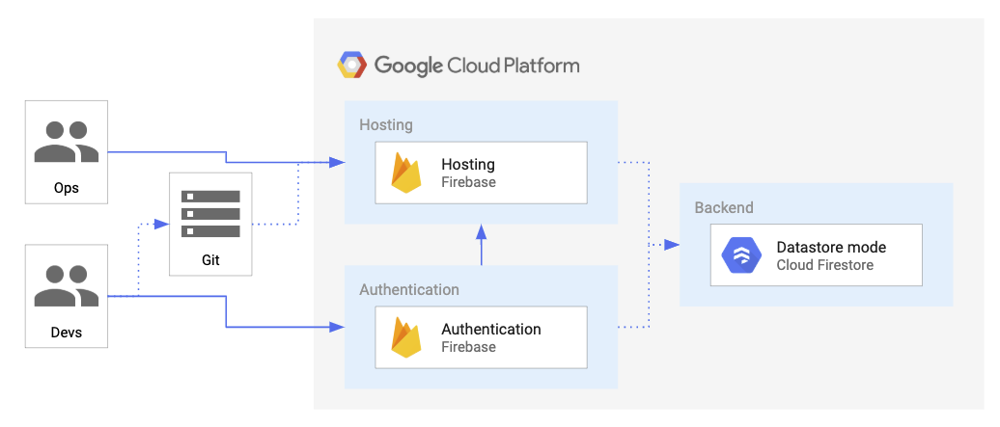
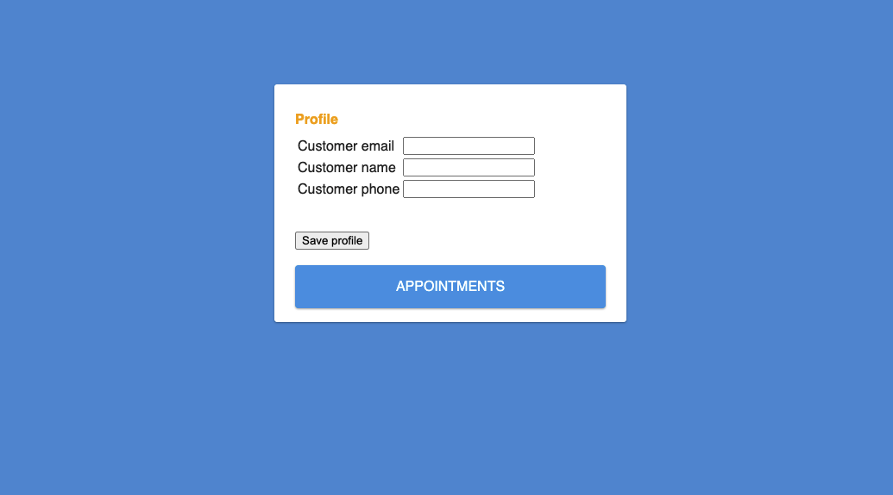
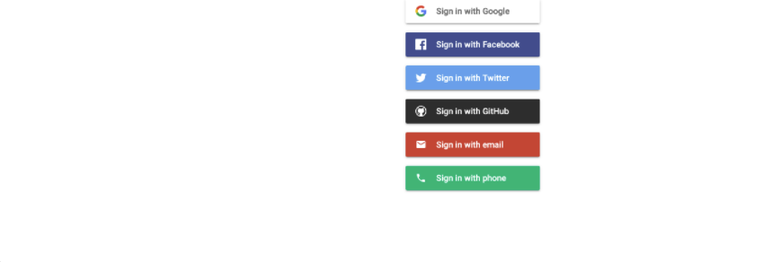
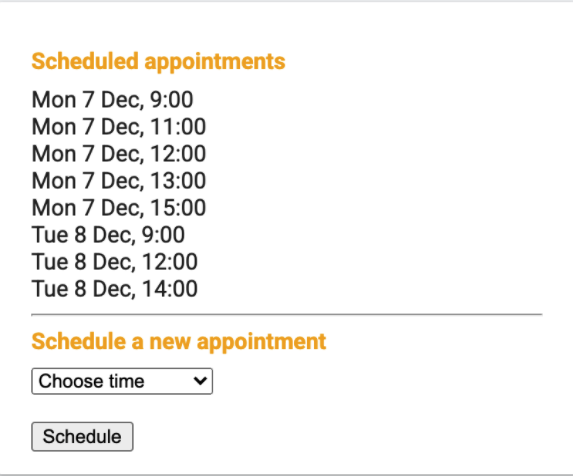

# XYZ Company Appointment Schejuler

# This Project is Inspired by The original Idea of Martin Omander For Google Cloud
## Author: 
Martin Omander

# The Project Used The Following Google Cloud Services

* Enable the Firebase API in your GCP project.
* Create and configure a Firebase project.
* Configure Firestore Security to automate server-side authentication and authorization.
* Add Google sign-in to your web app.
* Configure your database so users can add their contact information.
* Explore and deploy code that allows users to schedule appointments.
* Explore Firebase’s real time updates in your web app. 

Qwiklabs Quest based on the presentation "Pet Theory"

[GSP643 Lab 02 - Build a Serverless Web App with Firebase](https://google.qwiklabs.com/catalog_lab/2166)

# Project Architecture

# Customer Profile

# Firebase login

# schedule 

# serverless-appointment-scheduler
# serverless-appointment-seheduler
